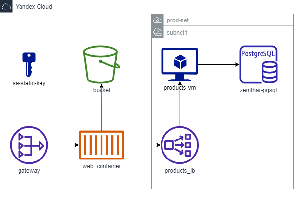

# Zenithar

**Команда**: Heim

**Участники**: Никита Богданов РИ-300016 (АТ-02)

**Zenithar** - небольшой онлайн магазин

### Сценарии

- Просмотр товаров
- Добавление товаров в корзину
- Редактирование корзины
- - Увеличение\уменьшение количества экземпляров товар
- - Отчистка корзины
- Админка
- - CRUD Операции с товарами


### Компоненты

- ProductsAPI - сервис, предоставлявший REST API для взаимодействия с товарами
- PostgreSQL - База данных для товаров
- BFF - сервис, предоставляющий REST API для веб клиента, с целью упростить взаимодействие клиента с другими сервисами
- Web-сайт - приложение на React для предоставления веб-интерфейса пользователю

## Using
### Terraform for Yandex Cloud
1. [Prepare for work with terraform](https://cloud.yandex.com/en/docs/tutorials/infrastructure-management/terraform-quickstart)
2. Create [Yandex Container Registry](https://cloud.yandex.com/en/services/container-registry)
3. Push docker images into YCR*
4. Create `./terraform/terraform.tfvars` and fill it with variables, described in `variables.tf`, using `key = value` format
5. Navigate to `./terrafrom` and execute
```
terraform init
terrafrom paln -out main
```
6. For deployment run `terraform apply "main"`

\* [Serverless Containers](https://cloud.yandex.com/en/docs/serverless-containers/quickstart/container#create-container) supports only `cr.yandex`. You can use [github action's](./.github/workflows/main.yml) `vars.YANDEX_REGISTRY_ID` to push it on ci



### Local
Для локального запуска приложения можно воспользоваться docker-compose.yml в корне репозитория. Чтобы это сделать, нужно находясь в корне репозитория выполнить команду:
```
docker compose up
```
После чего перейти по http://localhost:8122

Образы можно пересобрать локально перейдя в католог .docker и запустив файл .docker/build-images.ps1
```
cd .docker
.\build-images.ps1
```

<details>
  <summary>Application level architecture</summary>

### Точки расширения
 - Добавление новых страниц на web-сайт
 - Добавление новых возможностей в API сервисов
 - Интеграция API сервисов друг с другом, или внешними сервисами

## Ключевые особенности
### Точки расширения
#### BackEnd
- Во всех апи-контроллерах используются сервисы из уровня приложения. Вся логика взаимодействия лежит именно в сервисах приложения. Контролеры лишь конвертируют модели веб запросов к доменным моделям и обратно. Это позволит в будущем легко изменять веб-апи (версионировать, меня модели и т. п.). При этом классы, реализующие логику приложения, будут оставаться не именными
- Для доступа к данным используется паттерн Репозиторий. Благодаря ему, легко отделить уровень хранения данных, от уровня, где эти данные используются. Это позволяет менять способы хранения данных, не задевая при это логику работы приложения
- Для конфигурации приложения используется паттерн Опции. С его помощью приложение легко настроить для запуска в разных конфигурациях, что облегчает его развертывание в различных средах. Кроме этого, все настройки можно менять не пересобирая приложения, обеспечивая тем самым бОльшую гибкость
#### FrontEnd
- Адаптивная верстка. Благодаря ей можно легко добавлять новые страницы и компоненты, сразу доступные для широкой аудитории пользователей
- Управление состоянием с помощью redux. Использование redux позволяет отделить логику хранения состояния от отрисовки компонентов. Благодаря этом становиться возможным более легко добавлять новые компоненты, не зависящие друг от друга
#### Дополнительно
- Для сервисов написанны Docker-файлы. Используя их, можно собрать image сервисов. После чего, можно использовать image для развертывания приложения в любой среде поддерживающей Docker. В связке с использованием возможности конфигурированния, это открывает возможность деплоя приложения в огромное количество сред
### DI-контейнер
Для сервисов используется Microsoft.DI. Конфигурация контейнера происходит до старта приложения. Подробнее можно узнать тут или тут.
### Разделение на слои
В каждом сервисе можно выделить четыре слоя:
1. Core
2. Application
3. DataAccess
4. WebApi
#### 1. Core
В этом слое инкапсулирована доменная область для сервиса. Здесь хранятся модели содержащие в себе логику предметной области
#### 2. Application
В этом слое реализована логика для конкретных сценариев пользователя. Этот слой является связующим между слоем Core и DataAccess
#### 3. DataAccess
Этот слой реализует интерфейс для доступа к данным и их хранению. Он также инкапсулирует модели для хранения данных. Здесь происходит конвертация доменных моделей к моделям баз данных и обратно
#### 4. WebApi
Этот слой представляет собой публичный интерфейс для пользователей, в том числе и для других сервисов. Реализован в стиле REST API. Здесь преобразуется информация полученная из вне к известным доменным моделям и вызываются соответствующие запросы из уровня приложения (Application). После чего результат запроса преобразуется обратно из доменной модели к моделям WebApi, и отправляется клиенту
### Обработка ошибок
Для WebApi слоя обработка ошибок происходит в ExceptionFilter. Это гарантирует, что все ошибки, возникшие во время запросов пользователя, будут отловлены и приведены к единообразному виду. Таким образом и клиенту будет понятно почему запрос не удался, и мы не раскроем деталей внутренней реализации
В приложение присутствует легированные, благодаря которому мы узнаем, где и когда произошла ошибка. А также сможем понять более детально понять контекст ее возникновения, путем анализа логов

</details>